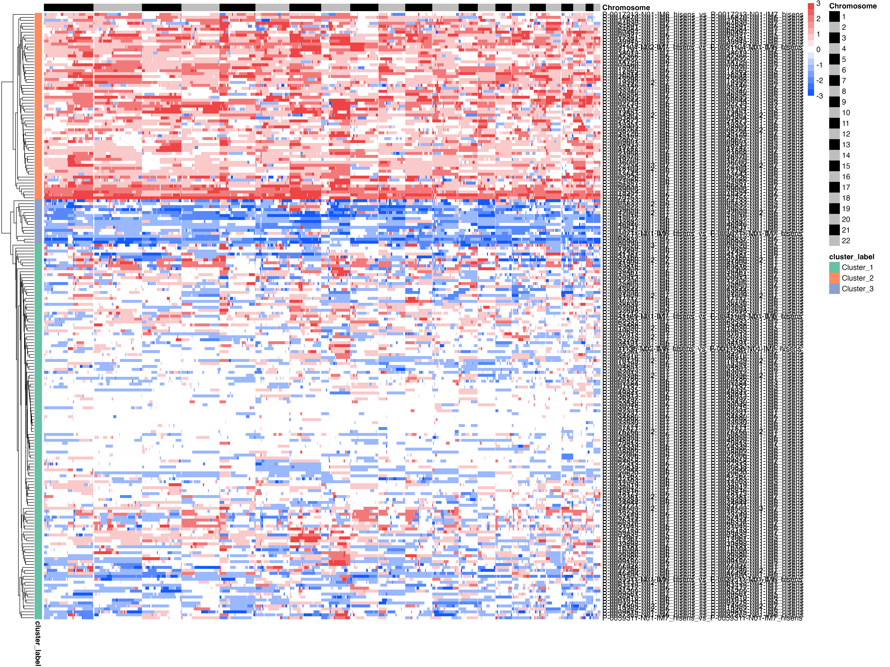
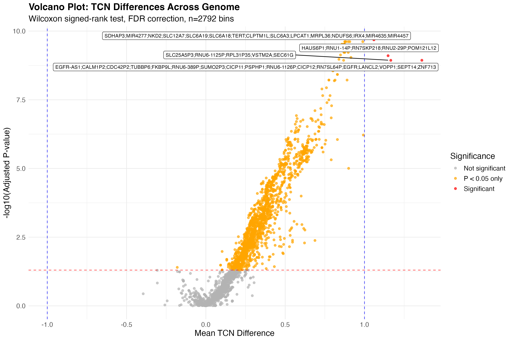
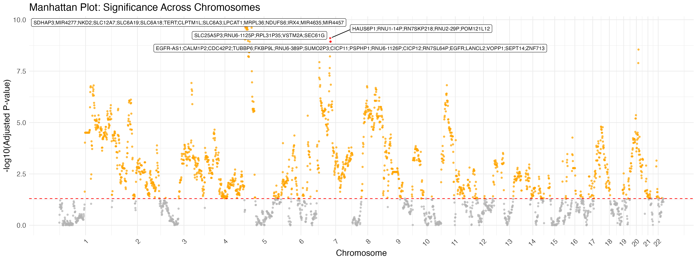

# CompareTCN

Functions for analyzing and comparing Total Copy Number (TCN) profiles between paired and unpaired cancer sample cohorts.

## Overview

CompareTCN provides tools for:
- **Paired cohort analysis**: Compare matched samples (e.g., primary vs. metastatic tumors from the same patients)
- **Unpaired cohort analysis**: Compare independent cohorts of different sizes
- **Statistical testing**: Wilcoxon signed-rank test for paired data, Mann-Whitney U test for unpaired data
- **Visualization**: Heatmaps, volcano plots, Manhattan plots, and individual comparison plots
- **Gene annotation**: Integration with Biomart and OncoKB databases

## Features

### Paired Cohort Analysis
- Compares matched sample pairs (e.g., primary tumor vs. brain metastasis)
- Uses **Wilcoxon signed-rank test** for proper paired statistical testing
- Generates pairwise comparison plots showing TCN differences
- Creates summary statistics for each patient pair

### Unpaired Cohort Analysis  
- Compares two independent cohorts of potentially different sizes
- Uses **Mann-Whitney U test** for independent group comparisons
- Analyzes average TCN differences between cohorts
- Suitable for comparing different cancer types or treatment groups

## Visualizations

### Pairwise Comparison Plots
*Individual comparison showing unique and shared TCN segments between paired samples*

<!--  -->

### Lollipop Plots
*Distribution of pairwise differences across the compared cohort*

<!--  -->

### Average TCN Difference Plot
*Genome-wide view of average TCN differences with oncogenic gene annotations*

<!--  -->

### Heatmaps
*Clustered heatmap showing TCN differences across genomic bins and sample comparisons*

<!--  -->

### Volcano Plots
*Volcano plot highlighting statistically significant genomic regions with gene annotations*

<!--  -->

### Manhattan Plots
*Manhattan plot displaying -log10(adjusted p-values) across chromosomes 1-22*

<!--  -->


## Installation

```r
# Install required packages
install.packages(c("tidyverse", "ggtext", "ggrepel", "tidyheatmaps))

# Bioconductor packages
if (!require("BiocManager", quietly = TRUE))
    install.packages("BiocManager")
BiocManager::install(c("GenomicRanges", "plyranges"))

# Development version of tidyheatmaps
devtools::install_github("stemangiola/tidyheatmaps")
```

## Usage
```
source("CompareTCN_functions.R")

# Define your paired cohorts using names from the ID column of the cncf FACETS file
cohort_1 <- c("P-001-Primary", "P-002-Primary", "P-003-Primary")
cohort_2 <- c("P-001-Metastasis", "P-002-Metastasis", "P-003-Metastasis")

# Run paired analysis
generate_paired_cohort_analysis(
  cncf_path = "path/to/cncf_data.txt",
  biomart_gr_path = "path/to/biomart_annotations.rds",
  Cohort_1 = cohort_1,
  Cohort_2 = cohort_2,
  out_dir = "results/paired_analysis/",
  oncokb_cnas_path = "path/to/oncokb_cna_data.txt",
  bin_size = 1e6,
  tcn_diff_threshold = 1,
  exact_match = FALSE, 
  prefer_hisens = TRUE
)
```


